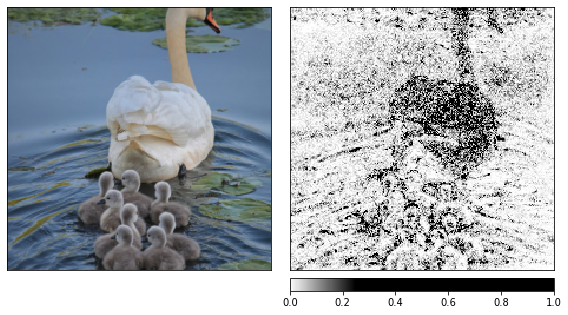
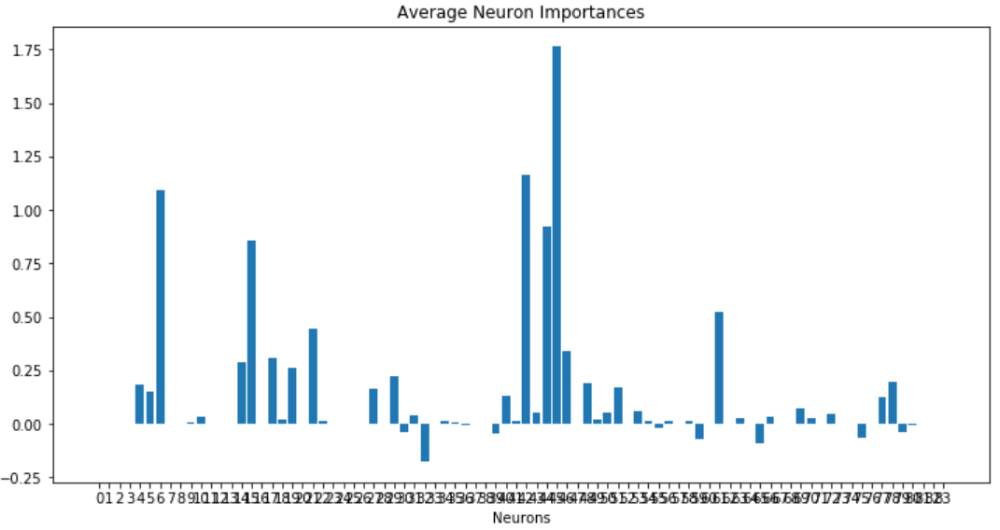
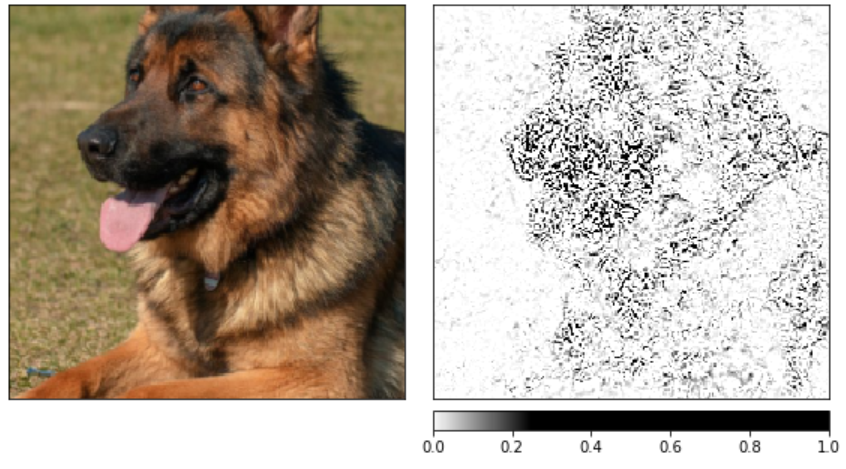

# Interpreting PyTorch models with Captum



Captum is a flexible easy-to-use model interpretability library for PyTorch, providing state-of-the-art tools for understanding how specific neurons and layers affect predictions.

## Installation

Captum can be install using either Conda or Pip:

```bash
conda install captum -c pytorch
or
pip install captum
```

## [Getting started with Captum](Getting_started_with_Captum_Insights.ipynb)



This notebook will walk you through the process of analysing your model using Captum Insights

## [Interpret computer vision model with Captum](Interpret_computer_vision_model_with_Captum.ipynb)



This notebook will walk you through the process of gaining information about your CNN with Captum. This notebook is based on one of Captums official tutorials.

## [Getting started with Captum Insights](Interpret_your_PyTorch_model_with_Captum.ipynb)


This notebook demonstrates how to use the methods available in Captum. It isn't focused on gaining information from the results. Rather it aims to give you information about how to implement Captum in your own project.

## Author

**Gilbert Tanner**
