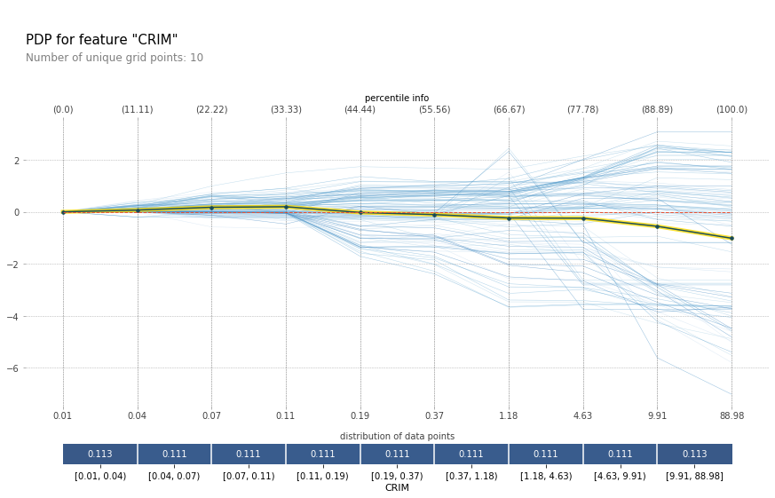

# PDPbox - python partial dependence plot toolbox



PDPbox lets you visualize the impact of certain feature towards model prediction using partial dependence plots and information plots.

> The partial dependence plot (short PDP or PD plot) shows the marginal effect one or two features have on the predicted outcome of a machine learning model — J. H. Friedman

## Installation

through pip:

```bash
pip install pdpbox
```

through git:

```bash
git clone https://github.com/SauceCat/PDPbox.git
cd PDPbox
python setup.py install
```

## Examples

- [PDPbox_Boston_Dataset_Example](PDPbox_Boston_Dataset_Example.ipynb)
