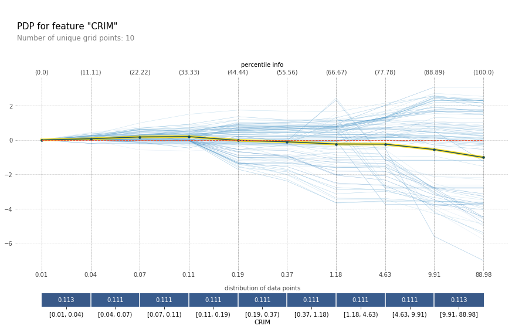

# Model Interpretation

As models become more and more complex, it's becoming increasingly important to develop methods for interpreting the model's decisions. In this repository, I try to provide an overview of some libraries you can use to interpret models.

If you want more information about the topic, you can check out my articles:
* [Introduction to Machine Learning Model Interpretation](https://gilberttanner.com/blog/introduction-to-machine-learning-model-interpretation)
* [Hands-on Global Model Interpretation](https://gilberttanner.com/blog/hands-on-global-model-interpretation)
* [Local Model Interpretation: An Introduction](https://gilberttanner.com/blog/local-model-interpretation-an-introduction)
* [Interpreting Tensorflow models with tf-explain](https://gilberttanner.com/blog/interpreting-tensorflow-model-with-tf-explain)
* [Interpreting PyTorch models with Captum](https://gilberttanner.com/blog/interpreting-pytorch-models-with-captum)

## [Captum](Captum/)

Captum is a flexible, easy-to-use model interpretability library for PyTorch, providing state-of-the-art tools for understanding how specific neurons and layers affect predictions.

## [tf-explain](TFExplain/)

tf-explain implements interpretability methods for Tensorflow models. It supports two APIs: the Core API, which allows you to interpret a model after training, and a Callback API which lets you use callbacks to monitor the model while training.

## [Shap](Shap/)

SHAP (SHapley Additive exPlanations) is a game-theoretic approach to explain any machine learning model's output. It connects optimal credit allocation with local explanations using the classical Shapley values from game theory and their related extensions (see papers for details and citations).

## [LIME](Lime/)

Lime, Local Interpretable Model-Agnostic, is a local model interpretation technique using Local surrogate models to approximate the predictions of the underlying black-box model.

## [ELI5](eli5/)

ELI5 helps debug machine learning classifiers and explain their predictions. It includes:
* [Permutation Importance](https://eli5.readthedocs.io/en/latest/blackbox/permutation_importance.html#eli5-permutation-importance)
* [TextExplainer](https://eli5.readthedocs.io/en/latest/tutorials/black-box-text-classifiers.html#lime-tutorial)

## [PDPbox - python partial dependence plot toolbox](PDPbox/)

PDPbox lets you visualize the impact of certain feature towards model prediction using partial dependence plots and information plots.

> The partial dependence plot (short PDP or PD plot) shows the marginal effect one or two features have on the predicted outcome of a machine learning model — J. H. Friedman

## Credit

Credit goes to the people how wrote the libraries covert in the repository. I'm merely showing you some examples so you can get an idea of how the libraries work.