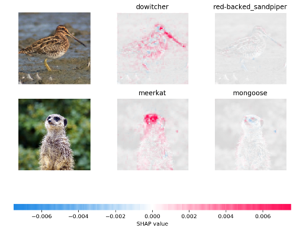

# Shap (SHapley Additive exPlanations)



SHAP (SHapley Additive exPlanations) is a game theoretic approach to explain the output of any machine learning model. It connects optimal credit allocation with local explanations using the classic Shapley values from game theory and their related extensions (see papers for details and citations).

## Install

Shap can be installed from either PyPI or conda:

```bash
pip install shap
or
conda install -c conda-forge shap
```

# Examples

SHAP has an excellent documentation with lots of examples. For getting started I included two examples from [the documentation](https://github.com/slundberg/shap).

The [tree_explainer_example.ipynb file](tree_explainer_example.ipynb) shows you how to interpret the predictions of a xgboost model.

The [gradient_explainer_example.ipynb file](gradient_explainer_example.ipynb) goes over how to use the GradientExplainer to interpret the predictions of a Keras model (Tensorflow 1.x backend).
