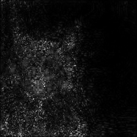
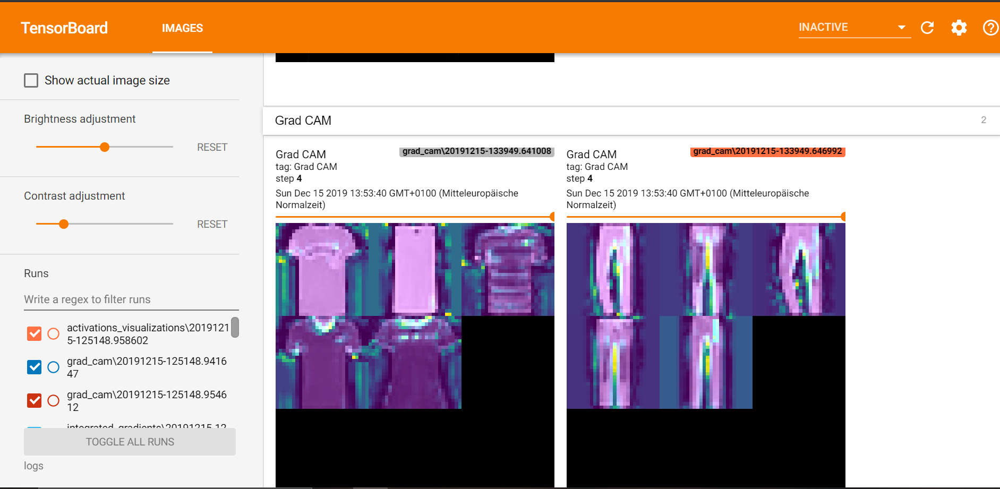

# Interpret Tensorflow models with tf-explain

tf-explain implements interpretability methods for Tensorflow models. It supports two APIs: the Core API which allows you to interpret a model after it was trained and a Callback API which lets you use callbacks to monitor the model whilst training.

## Using tf-explain to interpret the predictions of a model after training

tf-explain can be used to interpret the prediction of a model after it was trained. This can help to gain an understanding of what the model really learned whilst training.

As of now, tf-explain offers 5 different methods for interpreting neural networks:

- [Activations Visualization](https://github.com/sicara/tf-explain#activations-visualization)
- [Vanilla Gradients](https://github.com/sicara/tf-explain#vanilla-gradients)
- [Occlusion Sensitivity](https://github.com/sicara/tf-explain#occlusion-sensitivity)
- [Grad CAM (Class Activation Maps)](https://github.com/sicara/tf-explain#grad-cam)
- [SmoothGrad](https://github.com/sicara/tf-explain#smoothgrad)
- [Integrated Gradients](https://github.com/sicara/tf-explain#integrated-gradients)

Core API Examples:

- [Simple Example](simple_example.py)

## Using the callback api

Using the Callback API you can perform on-training monitoring. Being able to observe the behavior of your model whilst training to decide whether your model is reasonable can save you from hours of trying to train a false behaving model.

TF-explains callbacks can be used like any other Keras callback. You can see an example in the [callback_api_example.ipynb file](callback_api_example.ipynb).
