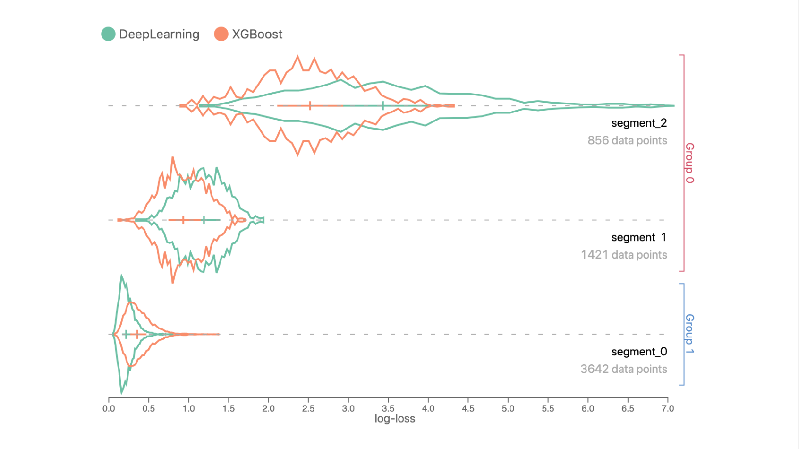

# Uber Manifold

Manifold is a model-agnostic visual debugging tool for machine learning created and open-sourced by Uber. 

Manifold allows ML practitioners to look beyond summary metrics like RMSE (Root Mean Squared Error) or AUC (Area under the ROC Curve) to detect which subset of data a model is inaccurately predicting. 

For more information, visit the [Manifold Github repository](https://github.com/uber/manifold) or [Manifold demo app](http://manifold.mlvis.io/).