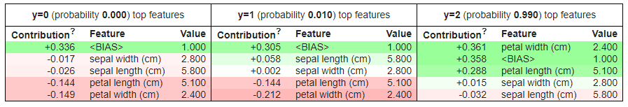

# ELI5



ELI5 helps debug machine learning classifiers and explain their predictions. It includes:

- [Permutation Importance](https://eli5.readthedocs.io/en/latest/blackbox/permutation_importance.html#eli5-permutation-importance)
- [TextExplainer](https://eli5.readthedocs.io/en/latest/tutorials/black-box-text-classifiers.html#lime-tutorial)

## Installation

ELI5 works in Python 2.7 and Python 3.4+ and can be install using pip:

```bash
pip install eli5
```

or using conda:

```bash
conda install -c conda-forge eli5
```

## Examples

- [Iris Feature Importance Example](ELI5_Iris_Feature_Importance_Example.ipynb)
- [Text Explainer Example](ELI5_Text_Explainer_Example.ipynb)
- [Image Classifier Grad-CAM Example](ELI5_Image_Classifier_Explained_Example.ipynb)

For more examples check out the [ELI5 documentation](https://eli5.readthedocs.io/en/latest/overview.html).
